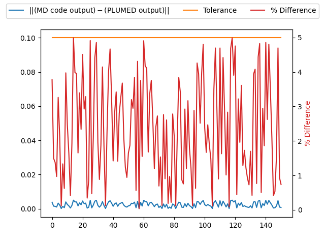

Energy is passed correctly
--------------------------

It is common practise to use the potential energy as a collective energy.  Some MD codes thus pass the potential energy to PLUMED. 
To check that this quantity has been passed correctly we can output the passed energy from PLUMED using the following input.  



 Click on the labels of the actions for more information on what each action computes 

<pre class="plumedlisting">
<b name="working1.date" onclick='showPath("working1.dat","working1.date","working1.date","black")'>e</b>The ENERGY action with label <b>e</b> calculates the following quantities:<table  align="center" frame="void" width="95%" cellpadding="5%"><tr><td width="5%"><b> Quantity </b>  </td><td width="5%"><b> Type </b>  </td><td><b> Description </b> </td></tr><tr><td width="5%">e</td><td width="5%">scalar</td><td>the internal energy</td></tr></table>: ENERGYCalculate the total potential energy of the simulation box. <a href="https://www.plumed.org/doc-master/user-doc/html/ENERGY" style="color:green">More details</a><i></i> 
PRINTPrint quantities to a file. <a href="https://www.plumed.org/doc-master/user-doc/html/PRINT" style="color:green">More details</a><i></i> ARGthe labels of the values that you would like to print to the file<i></i>=<b name="working1.date">e</b> FILEthe name of the file on which to output these quantities<i></i>=colvar
</pre>

  

We can then also output the energy from the MD code and check this matches the value output by PLUMED.  We run a short trajectory to test that the energy is passed correctly.

# Trajectory

Input and output files for the test calculation are available inthis [zip archive](energy_v2.10.zip)

# Results

| MD code output | PLUMED output | Tolerance | % Difference | 
|:-------------|:--------------|:--------------|:--------------| 
| -39774.13 | -39774.126227 | 0.1 | 3.772999996726867 |
| -39775.37 | -39775.368505 | 0.1 | 1.4950000040698797 |
| -39777.68 | -39777.681378 | 0.1 | 1.3780000008409843 |
| -39780.55 | -39780.54903 | 0.1 | 0.9700000009615906 |
| -39784.93 | -39784.926737 | 0.1 | 3.262999998696614 |
| -39790.64 | -39790.637882 | 0.1 | 2.117999996698927 |
| -39796.85 | -39796.850112 | 0.1 | 0.11200000153621659 |
| -39803.15 | -39803.151335 | 0.1 | 1.335000000835862 |
| -39810.53 | -39810.530624 | 0.1 | 0.6240000002435409 |
| -39818.79 | -39818.793975 | 0.1 | 3.974999999627471 |
| -39827.23 | -39827.22754 | 0.1 | 2.4600000033387914 |
| -39837.68 | -39837.67837 | 0.1 | 1.6299999988405034 |
| -39848.450000000004 | -39848.449583 | 0.1 | 0.41700000292621553 |
| -39858.69 | -39858.691928 | 0.1 | 1.927999997860752 |
| -39873.17 | -39873.165009 | 0.1 | 4.991000001609791 |
| -39886.97 | -39886.973981 | 0.1 | 3.9810000016586855 |
| -39900.87 | -39900.873959 | 0.1 | 3.958999994210899 |
| -39913.5 | -39913.498347 | 0.1 | 1.6529999993508682 |
| -39926.64 | -39926.643395 | 0.1 | 3.394999999727588 |
| -39942.53 | -39942.532338 | 0.1 | 2.3379999984172173 |

The table below includes some of the results from the calculation.  The columns contain:

1. The energies that were obtained from the MD code, $x_{md}$.
2. The energies that were obtained from PLUMED, $x_{pl}$.
3. The tolerances that were used when comparing these quantities, $\delta$.
4. The values of $100\frac{\vert x_{md} - x_{pl}\vert }{ \delta }$.

If the PLUMED interface is working correctly the first two sets of numbers should be identical and the final column should be filled with zeros.

### Graphical representation (_beta_)
A visualization of the table above:  

