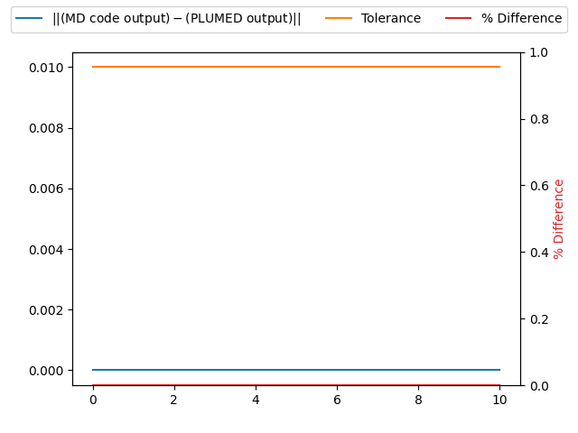

Number of atoms passed correctly
--------------------------------

PLUMED must receive the number of atoms that are being simulated from the MD code in order to calculate CVs correctly.  
To test this number is passed correctly to PLUMED we run a short trajectory and output the positions of all the atoms 
that are passed to PLUMED using the following command:



 Click on the labels of the actions for more information on what each action computes 

<pre class="plumedlisting">
DUMPATOMSDump selected atoms on a file. <a href="https://www.plumed.org/doc-master/user-doc/html/DUMPATOMS" style="color:green">More details</a><i></i> ATOMSthe atom indices whose positions you would like to print out<i></i>=@mdatomsrefers to all the MD codes atoms but not PLUMEDs vatoms. <a href="https://www.plumed.org/doc-master/user-doc/html/specifying_atoms">Click here</a> for more information. <i></i> FILEfile on which to output coordinates; extension is automatically detected<i></i>=plumed.xyz
</pre>

  

# Trajectory

Input and output files for the test calculation are available inthis [zip archive](basic_v2.10.zip)

# Results

| MD code output | PLUMED output | Tolerance | % Difference | 
|:-------------|:--------------|:--------------|:--------------| 
| 256 | 256 | 0.01 | 0.0 |
| 256 | 256 | 0.01 | 0.0 |
| 256 | 256 | 0.01 | 0.0 |
| 256 | 256 | 0.01 | 0.0 |
| 256 | 256 | 0.01 | 0.0 |
| 256 | 256 | 0.01 | 0.0 |
| 256 | 256 | 0.01 | 0.0 |
| 256 | 256 | 0.01 | 0.0 |
| 256 | 256 | 0.01 | 0.0 |
| 256 | 256 | 0.01 | 0.0 |
| 256 | 256 | 0.01 | 0.0 |

The first two columns of the table below contains the number of atoms that were in the structure the MD trajectory started from and the number of atomic positions
that were output by the command above.  If the PLUMED interface is working correctly these two numbers should be identical. 

### Graphical representation (_beta_)
A visualization of the table above:  

