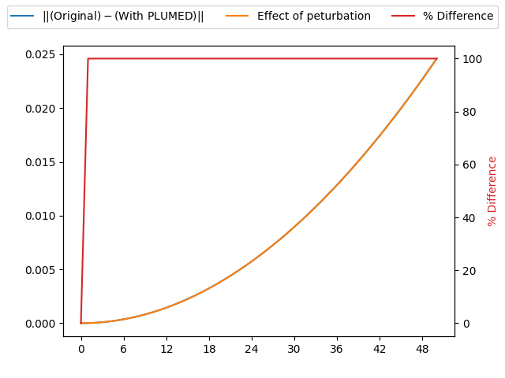

Check virial contribution
-------------------------

If you are running simulations at constant pressure then the virial forces cause the cell parameters 
to change with time.  Any CVs calculated by PLUMED contribute to these virial forces and PLUMED must,
therefore, have a mechanism to pass virial forces back to the MD code. 

To debug this mechanism we run a constant pressure simulation at 1 bar using the MD code.  During this simulation
we use the following PLUMED input to monitor the cell volume:



 Click on the labels of the actions for more information on what each action computes 

<pre class="plumedlisting">
<b name="working1.datv" onclick='showPath("working1.dat","working1.datv","working1.datv","black")'>v</b>The VOLUME action with label <b>v</b> calculates the following quantities:<table  align="center" frame="void" width="95%" cellpadding="5%"><tr><td width="5%"><b> Quantity </b>  </td><td width="5%"><b> Type </b>  </td><td><b> Description </b> </td></tr><tr><td width="5%">v</td><td width="5%">scalar</td><td>the volume of simulation box</td></tr></table>: VOLUMECalculate the volume the simulation box. <a href="https://www.plumed.org/doc-master/user-doc/html/VOLUME" style="color:green">More details</a><i></i>
PRINTPrint quantities to a file. <a href="https://www.plumed.org/doc-master/user-doc/html/PRINT" style="color:green">More details</a><i></i> ARGthe labels of the values that you would like to print to the file<i></i>=<b name="working1.datv">v</b> FILEthe name of the file on which to output these quantities<i></i>=volume
</pre>

  

We then run a second constant pressure MD simulation at a pressure of 1001 bar and the input above.

If the virial has been implemented correctly within PLUMED the following PLUMED restraint will apply a negative pressure of 1000bar, which should compensate the fact that the
second calculation was run at higher pressure.  We thus run a third MD calculation with the following input file:



 Click on the labels of the actions for more information on what each action computes 

<pre class="plumedlisting">
<b name="working2.datv" onclick='showPath("working2.dat","working2.datv","working2.datv","black")'>v</b>The VOLUME action with label <b>v</b> calculates the following quantities:<table  align="center" frame="void" width="95%" cellpadding="5%"><tr><td width="5%"><b> Quantity </b>  </td><td width="5%"><b> Type </b>  </td><td><b> Description </b> </td></tr><tr><td width="5%">v</td><td width="5%">scalar</td><td>the volume of simulation box</td></tr></table>: VOLUMECalculate the volume the simulation box. <a href="https://www.plumed.org/doc-master/user-doc/html/VOLUME" style="color:green">More details</a><i></i> 
# slope should be just 10 times the Avogadro constant:
RESTRAINTAdds harmonic and/or linear restraints on one or more variables. <a href="https://www.plumed.org/doc-master/user-doc/html/RESTRAINT" style="color:green">More details</a><i></i> ATthe position of the restraint<i></i>=0.0 ARGthe values the harmonic restraint acts upon<i></i>=<b name="working2.datv">v</b> SLOPE specifies that the restraint is linear and what the values of the force constants on each of the variables are<i></i>=-60.2214129
The RESTRAINT action with label <b></b> calculates the following quantities:<table  align="center" frame="void" width="95%" cellpadding="5%"><tr><td width="5%"><b> Quantity </b>  </td><td><b> Description </b> </td></tr><tr><td width="5%">.bias</td><td>the instantaneous value of the bias potential</td></tr><tr><td width="5%">.force2</td><td>the instantaneous value of the squared force due to this bias potential</td></tr></table>PRINTPrint quantities to a file. <a href="https://www.plumed.org/doc-master/user-doc/html/PRINT" style="color:green">More details</a><i></i> ARGthe labels of the values that you would like to print to the file<i></i>=<b name="working2.datv">v</b> FILEthe name of the file on which to output these quantities<i></i>=volume2
</pre>

  

The time series for the volumes that are output by the files `volume` and `volume2` above should thus be close to identical. 

# Trajectories

 1. Input and output files for the unpeturbed calculation are available in this [zip archive](virial1_master.zip)

 2. Input and output files for the peturbed calculation are available in this [zip archive](virial3_master.zip)

 3. Input and output files for the peturbed calculation in which a PLUMED restraint is used to undo the effect of the changed MD parameters are available in this [zip archive](virial2_master.zip)

# Results

| Original | With PLUMED | Effect of peturbation | % Difference | 
|:-------------|:--------------|:--------------|:--------------| 
| 8.417458 | 8.417458 | 0.0 | 0.0 |
| 8.417685 | 8.417675 | 1.000000000139778e-05 | 100.0 |
| 8.418367 | 8.418327 | 4.000000000026205e-05 | 100.0 |
| 8.419504 | 8.419414 | 9.000000000014552e-05 | 100.0 |
| 8.421094 | 8.420934 | 0.00015999999999927184 | 100.0 |
| 8.423137 | 8.422886 | 0.0002510000000004453 | 100.0 |
| 8.425631 | 8.425271 | 0.0003599999999988057 | 100.0 |
| 8.428576 | 8.428085 | 0.0004910000000002412 | 100.0 |
| 8.431971 | 8.43133 | 0.0006409999999998917 | 100.0 |
| 8.435813 | 8.435001 | 0.0008119999999998129 | 100.0 |
| 8.440101 | 8.439099 | 0.0010019999999997253 | 100.0 |
| 8.444832 | 8.443621 | 0.001210999999999629 | 100.0 |
| 8.450006 | 8.448564 | 0.0014420000000008315 | 100.0 |
| 8.455619 | 8.453927 | 0.0016920000000002489 | 100.0 |
| 8.461669 | 8.459708 | 0.001961000000001434 | 100.0 |
| 8.468154 | 8.465903 | 0.002250999999999337 | 100.0 |
| 8.47507 | 8.47251 | 0.002560000000000784 | 100.0 |
| 8.482415 | 8.479525 | 0.002889999999998949 | 100.0 |
| 8.490185 | 8.486946 | 0.003239000000000658 | 100.0 |
| 8.498378 | 8.49477 | 0.0036079999999998336 | 100.0 |

The table below includes some of the results from the calculation.  The columns contain:

1. The time series for the volume that was obtained from the simulation in that was performed at 1 bar, $x_{md}$.
2. The time series for the volume that was obtained from the simulation that was performed at 1001 bar and in which PLUMED applied a restraint on the volume, $x_{pl}$.
3. The absolute value of the difference between the time series of volumes that were obtained from the simulations running at 1001 bar and 1 bar, $\vert x_{md}'-x_{md}\vert$.  No PLUMED restraints were applied in either of these simulations.
4. The values of $100\frac{\vert x_{md} - x_{pl}\vert }{ \vert x_{md}'-x_{md} \vert }$.

If the PLUMED interface is working correctly the first two sets of numbers should be identical and the final column should be filled with zeros.

### Graphical representation (_beta_)
A visualization of the table above:  

