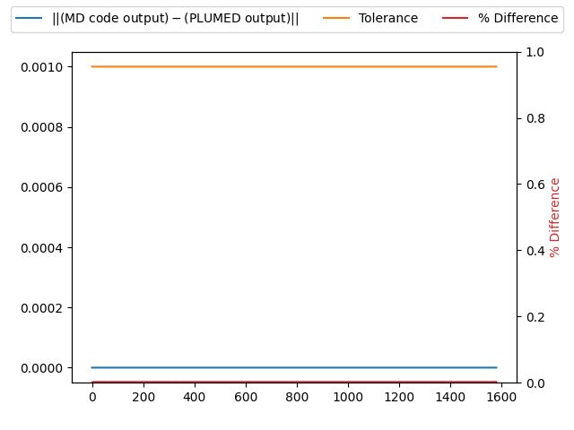

Charges are passed correctly
---------------------------

PLUMED must receive the charges from an MD code in order to calculate some CVs correctly.
To test that charges are passed correctly to PLUMED we run a short trajectory and output the charges of all the atoms that 
are passed to PLUMED using the following command: 



 Click on the labels of the actions for more information on what each action computes 

<pre class="plumedlisting">
DUMPMASSCHARGEDump masses and charges on a selected file. <a href="https://www.plumed.org/doc-master/user-doc/html/DUMPMASSCHARGE" style="color:green">More details</a><i></i> FILEfile on which to output charges and masses<i></i>=mq_plumed
</pre>

  

# Trajectory

Input and output files for the test calculation are available inthis [zip archive](basic_v2.10.zip)

# Results

| MD code output | PLUMED output | Tolerance | % Difference | 
|:-------------|:--------------|:--------------|:--------------| 
| 0.0 | 0.0 | 0.001 | 0.0 |
| 0.52422 | 0.5242199897766113 | 0.001 | 0.0010223388691166235 |
| 0.52422 | 0.5242199897766113 | 0.001 | 0.0010223388691166235 |
| -1.04844 | -1.048439979553223 | 0.001 | 0.002044677693824326 |
| 0.0 | 0.0 | 0.001 | 0.0 |
| 0.52422 | 0.5242199897766113 | 0.001 | 0.0010223388691166235 |
| 0.52422 | 0.5242199897766113 | 0.001 | 0.0010223388691166235 |
| -1.04844 | -1.048439979553223 | 0.001 | 0.002044677693824326 |
| 0.0 | 0.0 | 0.001 | 0.0 |
| 0.52422 | 0.5242199897766113 | 0.001 | 0.0010223388691166235 |
| 0.52422 | 0.5242199897766113 | 0.001 | 0.0010223388691166235 |
| -1.04844 | -1.048439979553223 | 0.001 | 0.002044677693824326 |
| 0.0 | 0.0 | 0.001 | 0.0 |
| 0.52422 | 0.5242199897766113 | 0.001 | 0.0010223388691166235 |
| 0.52422 | 0.5242199897766113 | 0.001 | 0.0010223388691166235 |
| -1.04844 | -1.048439979553223 | 0.001 | 0.002044677693824326 |
| 0.0 | 0.0 | 0.001 | 0.0 |
| 0.52422 | 0.5242199897766113 | 0.001 | 0.0010223388691166235 |
| 0.52422 | 0.5242199897766113 | 0.001 | 0.0010223388691166235 |
| -1.04844 | -1.048439979553223 | 0.001 | 0.002044677693824326 |

The table below includes some of the results from the calculation.  The columns contain:

1. The charges that were obtained from the MD code, $x_{md}$.
2. The charges that were obtained from PLUMED, $x_{pl}$.
3. The tolerances that were used when comparing these quantities, $\delta$.
4. The values of $100\frac{\vert x_{md} - x_{pl}\vert }{ \delta }$.

If the PLUMED interface is working correctly the first two sets of numbers should be identical and the final column should be filled with zeros.

### Graphical representation (_beta_)
A visualization of the table above:  

