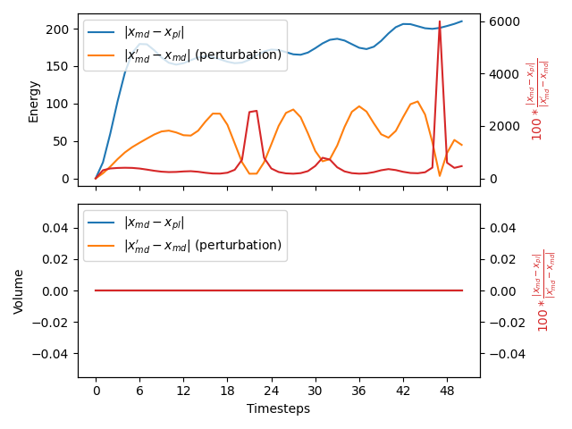

Check force on energy
---------------------

It is common practise to use the potential energy as a collective energy. Some MD codes thus pass the potential energy to PLUMED and
PLUMED can then apply forces on this collective variable.  We test that any forces that PLUMED applies on the potential energy are 
correctly passed back to the MD code by doing the following test.  We first run a short simulation at $T$ K with a timestep of $\tau$ ps.
During the course of this simulation we monitor the potential energy using the following PLUMED input:



 Click on the labels of the actions for more information on what each action computes 

<table><tr><td style="padding:1px"></td></tr><tr><td style="padding:1px"></td></tr></table>

<pre style="width=97%;">
<b name="working1.date" onclick='showPath("working1.dat","working1.date","working1.date","black")'>e</b>The ENERGY action with label <b>e</b> calculates the following quantities:<table  align="center" frame="void" width="95%" cellpadding="5%"><tr><td width="5%"><b> Quantity </b>  </td><td width="5%"><b> Type </b>  </td><td><b> Description </b> </td></tr><tr><td width="5%">e</td><td width="5%">scalar</td><td>the internal energy</td></tr></table>: ENERGYCalculate the total potential energy of the simulation box. <a href="https://www.plumed.org/doc-master/user-doc/html/_e_n_e_r_g_y.html" style="color:green">More details</a><i></i>
<b name="working1.datv" onclick='showPath("working1.dat","working1.datv","working1.datv","black")'>v</b>The VOLUME action with label <b>v</b> calculates the following quantities:<table  align="center" frame="void" width="95%" cellpadding="5%"><tr><td width="5%"><b> Quantity </b>  </td><td width="5%"><b> Type </b>  </td><td><b> Description </b> </td></tr><tr><td width="5%">v</td><td width="5%">scalar</td><td>the volume of simulation box</td></tr></table>: VOLUMECalculate the volume of the simulation box. <a href="https://www.plumed.org/doc-master/user-doc/html/_v_o_l_u_m_e.html" style="color:green">More details</a><i></i>
PRINTPrint quantities to a file. <a href="https://www.plumed.org/doc-master/user-doc/html/_p_r_i_n_t.html" style="color:green">More details</a><i></i> ARGthe labels of the values that you would like to print to the file<i></i>=<b name="working1.date">e</b>,<b name="working1.datv">v</b> FILEthe name of the file on which to output these quantities<i></i>=energy1
</pre>
  

We then run a second simulation (starting from identical conditions) at a temperature of $T\alpha$ and with a timestep of $\tau/\sqrt(\alpha)$.
The thermostat and barostat relaxation times are similarly divided by $\sqrt(\alpha)$.  In the tests that are run on this website we set $\sqrt(\alpha)=1.1$.
The PLUMED file above is used when this test is run but a different time series of energy values is recorded as the MD parameters in this second simulation are 
different.

If PLUMED is working correctly we should be able to recapture the time series of energy values for the first simulation by running an MD simulation with the modified 
parameters that were used in the second simulation and the following PLUMED input file:



 Click on the labels of the actions for more information on what each action computes 

<table><tr><td style="padding:1px"></td></tr><tr><td style="padding:1px"></td></tr></table>

<pre style="width=97%;">
<b name="working2.date" onclick='showPath("working2.dat","working2.date","working2.date","black")'>e</b>The ENERGY action with label <b>e</b> calculates the following quantities:<table  align="center" frame="void" width="95%" cellpadding="5%"><tr><td width="5%"><b> Quantity </b>  </td><td width="5%"><b> Type </b>  </td><td><b> Description </b> </td></tr><tr><td width="5%">e</td><td width="5%">scalar</td><td>the internal energy</td></tr></table>: ENERGYCalculate the total potential energy of the simulation box. <a href="https://www.plumed.org/doc-master/user-doc/html/_e_n_e_r_g_y.html" style="color:green">More details</a><i></i>
<b name="working2.datv" onclick='showPath("working2.dat","working2.datv","working2.datv","black")'>v</b>The VOLUME action with label <b>v</b> calculates the following quantities:<table  align="center" frame="void" width="95%" cellpadding="5%"><tr><td width="5%"><b> Quantity </b>  </td><td width="5%"><b> Type </b>  </td><td><b> Description </b> </td></tr><tr><td width="5%">v</td><td width="5%">scalar</td><td>the volume of simulation box</td></tr></table>: VOLUMECalculate the volume of the simulation box. <a href="https://www.plumed.org/doc-master/user-doc/html/_v_o_l_u_m_e.html" style="color:green">More details</a><i></i>
# slope is such that 
PRINTPrint quantities to a file. <a href="https://www.plumed.org/doc-master/user-doc/html/_p_r_i_n_t.html" style="color:green">More details</a><i></i> ARGthe labels of the values that you would like to print to the file<i></i>=<b name="working2.date">e</b> FILEthe name of the file on which to output these quantities<i></i>=energy2
# slope should be (alpha-1)=0.21
The PRINT action with label <b></b> calculates somethingRESTRAINTAdds harmonic and/or linear restraints on one or more variables. <a href="https://www.plumed.org/doc-master/user-doc/html/_r_e_s_t_r_a_i_n_t.html" style="color:green">More details</a><i></i> ATthe position of the restraint<i></i>=0.0 ARGthe values the harmonic restraint acts upon<i></i>=<b name="working2.date">e</b> SLOPE specifies that the restraint is linear and what the values of the force constants on each of the variables are<i></i>=0.21
</pre>
  

In other words, when forces are passed correctly the time series for the energies and volumes from the first and third of these calculations should be identical.  

To determine if PLUMED passes this test we calculate the difference between the time series that were observed in the first and third simulations described above.
We then divide this by the difference between the first and second time series.

An NPT version of this calculation is performed as well as an NVT calculation if the virial is passed to PLUMED.

# Trajectories

 1. Input and output files for the unpeturbed calculation are available in this [zip archive](engforces1_master.zip)

 2. Input and output files for the peturbed calculation are available in this [zip archive](engforces3_master.zip)

 3. Input and output files for the peturbed calculation in which a PLUMED restraint is used to undo the effect of the changed MD parameters are available in this [zip archive](engforces2_master.zip)

# Results

| Original | With PLUMED | Effect of peturbation | % Difference | 
|:-------------|:--------------|:--------------|:--------------| 
| -18174.8223 11.6346 | -18174.8223 11.6346 | 0.0000 0.0000 | 0.0000 0.0000 | 
| -18171.8203 11.6346 | -18193.2891 11.6346 | 6.8730 0.0000 | 312.3615 0.0000 | 
| -18176.6543 11.6346 | -18236.5293 11.6346 | 15.7891 0.0000 | 379.2182 0.0000 | 
| -18179.2598 11.6346 | -18282.3086 11.6346 | 25.8223 0.0000 | 399.0697 0.0000 | 
| -18176.8105 11.6346 | -18318.1055 11.6346 | 34.7344 0.0000 | 406.7870 0.0000 | 
| -18169.6172 11.6346 | -18337.2207 11.6346 | 41.7988 0.0000 | 400.9766 0.0000 | 
| -18161.1270 11.6346 | -18340.6543 11.6346 | 47.6152 0.0000 | 377.0376 0.0000 | 
| -18156.0508 11.6346 | -18335.1348 11.6346 | 53.1934 0.0000 | 336.6661 0.0000 | 
| -18157.4258 11.6346 | -18328.6348 11.6346 | 58.6094 0.0000 | 292.1188 0.0000 | 
| -18164.9219 11.6346 | -18326.4336 11.6346 | 62.7227 0.0000 | 257.5014 0.0000 | 
| -18174.9785 11.6346 | -18329.3828 11.6346 | 63.8320 0.0000 | 241.8916 0.0000 | 
| -18183.3926 11.6346 | -18335.3457 11.6346 | 61.4082 0.0000 | 247.4476 0.0000 | 
| -18188.5391 11.6346 | -18342.3438 11.6346 | 57.6973 0.0000 | 266.5719 0.0000 | 
| -18193.3008 11.6346 | -18351.2285 11.6346 | 57.1973 0.0000 | 276.1106 0.0000 | 
| -18203.2832 11.6346 | -18364.9277 11.6346 | 63.7207 0.0000 | 253.6766 0.0000 | 
| -18221.6113 11.6346 | -18384.7578 11.6346 | 75.9590 0.0000 | 214.7823 0.0000 | 
| -18244.9160 11.6346 | -18406.9043 11.6346 | 86.5586 0.0000 | 187.1429 0.0000 | 
| -18264.2051 11.6346 | -18423.2441 11.6346 | 86.4355 0.0000 | 183.9973 0.0000 | 
| -18270.6641 11.6346 | -18426.4570 11.6346 | 71.6328 0.0000 | 217.4883 0.0000 | 
| -18261.2734 11.6346 | -18415.1465 11.6346 | 46.7129 0.0000 | 329.4017 0.0000 | 

The table below includes some of the results from the calculation.  The columns contain:

1. Time series for the energy and volume that were obtained from the simulation at $T$ K, $x_{md}$.
2. Time series for the energy and volume that were obtained from the simulation at $\alpha T$ K and in which PLUMED applied a restraint on the energy, $x_{pl}$.
3. The absolute value of the difference between the time series of energies and volumes that were obtained from the simulations running at $T$ K and $\alpha T$ K, $\vert x_{md}'-x_{md} \vert$.  No PLUMED restraints were applied in either of these simulations.
4. The values of $100\frac{\vert x_{md} - x_{pl}\vert }{ \vert x_{md}'-x_{md} \vert}$. 

If the PLUMED interface is working correctly the first two sets of numbers should be identical and the final column should be filled with zeros.

### Graphical representation (_beta_)
A visualization of the table above:  

