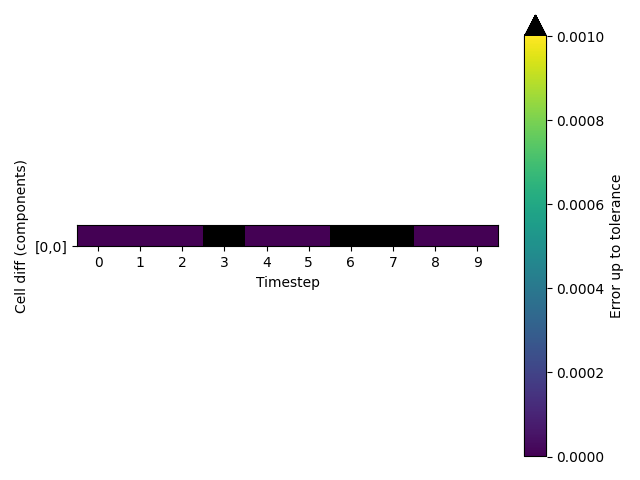

Cell vectors are passed correctly
---------------------------------

PLUMED must receive the cell vectors from the MD code in order to calculate CVs correctly.  
To test that cell vectors are passed correctly to PLUMED we run a short trajectory and output the cell vectors 
that are passed to PLUMED using the following command: 



 Click on the labels of the actions for more information on what each action computes 

<pre class="plumedlisting">
<b name="working1.datc" onclick='showPath("working1.dat","working1.datc","working1.datc","black")'>c</b>The CELL action with label <b>c</b> calculates the following quantities:<table  align="center" frame="void" width="95%" cellpadding="5%"><tr><td width="5%"><b> Quantity </b>  </td><td width="5%"><b> Type </b>  </td><td><b> Description </b> </td></tr><tr><td width="5%">c.ax</td><td width="5%">scalar</td><td>the ax component of the cell matrix</td></tr><tr><td width="5%">c.ay</td><td width="5%">scalar</td><td>the ay component of the cell matrix</td></tr><tr><td width="5%">c.az</td><td width="5%">scalar</td><td>the az component of the cell matrix</td></tr><tr><td width="5%">c.bx</td><td width="5%">scalar</td><td>the bx component of the cell matrix</td></tr><tr><td width="5%">c.by</td><td width="5%">scalar</td><td>the by component of the cell matrix</td></tr><tr><td width="5%">c.bz</td><td width="5%">scalar</td><td>the bz component of the cell matrix</td></tr><tr><td width="5%">c.cx</td><td width="5%">scalar</td><td>the cx component of the cell matrix</td></tr><tr><td width="5%">c.cy</td><td width="5%">scalar</td><td>the cy component of the cell matrix</td></tr><tr><td width="5%">c.cz</td><td width="5%">scalar</td><td>the cz component of the cell matrix</td></tr></table>: CELLGet the components of the simulation cell <a href="https://www.plumed.org/doc-master/user-doc/html/CELL" style="color:green">More details</a><i></i> 
</pre>

  

# Trajectory

Input and output files for the test calculation are available inthis [zip archive](basic_master.zip)

# Results

| MD code output | PLUMED output | Tolerance | % Difference | 
|:-------------|:--------------|:--------------|:--------------| 
| $\begin{array}{ccc} 1.7846 & 0.0000 & 0.0000 \\\\ 0.0000 & 1.7846 & 0.0000 \\\\ 0.0000 & 0.0000 & 1.7846 \end{array}$ | $\begin{array}{ccc} 1.7846 & 0.0000 & 0.0000 \\\\ 0.0000 & 1.7846 & 0.0000 \\\\ 0.0000 & 0.0000 & 1.7846 \end{array}$ | $\begin{array}{ccc} 0.0010 & 0.0010 & 0.0010 \\\\ 0.0010 & 0.0010 & 0.0010 \\\\ 0.0010 & 0.0010 & 0.0010 \end{array}$ | $\begin{array}{ccc} 0.0000 & 0.0000 & 0.0000 \\\\ 0.0000 & 0.0000 & 0.0000 \\\\ 0.0000 & 0.0000 & 0.0000 \end{array}$ | 
| $\begin{array}{ccc} 1.7845 & 0.0000 & 0.0000 \\\\ 0.0000 & 1.7845 & 0.0000 \\\\ 0.0000 & 0.0000 & 1.7845 \end{array}$ | $\begin{array}{ccc} 1.7845 & 0.0000 & 0.0000 \\\\ 0.0000 & 1.7845 & 0.0000 \\\\ 0.0000 & 0.0000 & 1.7845 \end{array}$ | $\begin{array}{ccc} 0.0010 & 0.0010 & 0.0010 \\\\ 0.0010 & 0.0010 & 0.0010 \\\\ 0.0010 & 0.0010 & 0.0010 \end{array}$ | $\begin{array}{ccc} 0.0000 & 0.0000 & 0.0000 \\\\ 0.0000 & 0.0000 & 0.0000 \\\\ 0.0000 & 0.0000 & 0.0000 \end{array}$ | 
| $\begin{array}{ccc} 1.7842 & 0.0000 & 0.0000 \\\\ 0.0000 & 1.7842 & 0.0000 \\\\ 0.0000 & 0.0000 & 1.7842 \end{array}$ | $\begin{array}{ccc} -0.0009 & -0.0000 & -0.0000 \\\\ 0.0000 & -0.0008 & 0.0002 \\\\ 0.0000 & 0.0000 & -0.0007 \end{array}$ | $\begin{array}{ccc} 0.0010 & 0.0010 & 0.0010 \\\\ 0.0010 & 0.0010 & 0.0010 \\\\ 0.0010 & 0.0010 & 0.0010 \end{array}$ | $\begin{array}{ccc} 178516.9000 & 4.6000 & 1.7000 \\\\ 0.0000 & 178504.3000 & 23.6000 \\\\ 0.0000 & 0.0000 & 178491.3000 \end{array}$ | 
| $\begin{array}{ccc} 1.7838 & 0.0000 & 0.0000 \\\\ 0.0000 & 1.7838 & 0.0000 \\\\ 0.0000 & 0.0000 & 1.7838 \end{array}$ | $\begin{array}{ccc} 1.7838 & 0.0000 & 0.0000 \\\\ 0.0000 & 1.7838 & 0.0000 \\\\ 0.0000 & 0.0000 & 1.7838 \end{array}$ | $\begin{array}{ccc} 0.0010 & 0.0010 & 0.0010 \\\\ 0.0010 & 0.0010 & 0.0010 \\\\ 0.0010 & 0.0010 & 0.0010 \end{array}$ | $\begin{array}{ccc} 0.0000 & 0.0000 & 0.0000 \\\\ 0.0000 & 0.0000 & 0.0000 \\\\ 0.0000 & 0.0000 & 0.0000 \end{array}$ | 
| $\begin{array}{ccc} 1.7833 & 0.0000 & 0.0000 \\\\ 0.0000 & 1.7833 & 0.0000 \\\\ 0.0000 & 0.0000 & 1.7833 \end{array}$ | $\begin{array}{ccc} -0.0009 & -0.0000 & -0.0000 \\\\ 0.0000 & -0.0008 & 0.0003 \\\\ 0.0000 & 0.0000 & -0.0007 \end{array}$ | $\begin{array}{ccc} 0.0010 & 0.0010 & 0.0010 \\\\ 0.0010 & 0.0010 & 0.0010 \\\\ 0.0010 & 0.0010 & 0.0010 \end{array}$ | $\begin{array}{ccc} 178423.5000 & 4.8000 & 2.8000 \\\\ 0.0000 & 178410.3000 & 25.1000 \\\\ 0.0000 & 0.0000 & 178397.1000 \end{array}$ | 
| $\begin{array}{ccc} 1.7827 & 0.0000 & 0.0000 \\\\ 0.0000 & 1.7827 & 0.0000 \\\\ 0.0000 & 0.0000 & 1.7827 \end{array}$ | $\begin{array}{ccc} 1.7827 & 0.0000 & 0.0000 \\\\ 0.0000 & 1.7827 & 0.0000 \\\\ 0.0000 & 0.0000 & 1.7827 \end{array}$ | $\begin{array}{ccc} 0.0010 & 0.0010 & 0.0010 \\\\ 0.0010 & 0.0010 & 0.0010 \\\\ 0.0010 & 0.0010 & 0.0010 \end{array}$ | $\begin{array}{ccc} 0.0000 & 0.0000 & 0.0000 \\\\ 0.0000 & 0.0000 & 0.0000 \\\\ 0.0000 & 0.0000 & 0.0000 \end{array}$ | 
| $\begin{array}{ccc} 1.7819 & 0.0000 & 0.0000 \\\\ 0.0000 & 1.7819 & 0.0000 \\\\ 0.0000 & 0.0000 & 1.7819 \end{array}$ | $\begin{array}{ccc} 1.7819 & 0.0000 & 0.0000 \\\\ 0.0000 & 1.7819 & 0.0000 \\\\ 0.0000 & 0.0000 & 1.7819 \end{array}$ | $\begin{array}{ccc} 0.0010 & 0.0010 & 0.0010 \\\\ 0.0010 & 0.0010 & 0.0010 \\\\ 0.0010 & 0.0010 & 0.0010 \end{array}$ | $\begin{array}{ccc} 0.0000 & 0.0000 & 0.0000 \\\\ 0.0000 & 0.0000 & 0.0000 \\\\ 0.0000 & 0.0000 & 0.0000 \end{array}$ | 
| $\begin{array}{ccc} 1.7810 & 0.0000 & 0.0000 \\\\ 0.0000 & 1.7810 & 0.0000 \\\\ 0.0000 & 0.0000 & 1.7810 \end{array}$ | $\begin{array}{ccc} 0.0000 & -35903903862683307742527202168443007372712402794422997513076696361585482333827280786658806690476779742614360622536750328375314860525105727043609818463538139875316705654641892871673297609452043081628318159144342269574506131816711923965682025603166048953779657120026957859375495812370529255424.0000 & 0.0000 \\\\ 0.0000 & 1.7810 & 0.0000 \\\\ 0.0000 & 0.0000 & 1.7810 \end{array}$ | $\begin{array}{ccc} 0.0010 & 0.0010 & 0.0010 \\\\ 0.0010 & 0.0010 & 0.0010 \\\\ 0.0010 & 0.0010 & 0.0010 \end{array}$ | $\begin{array}{ccc} 178098.3000 & 3590390386268331090008190996507753911987334395356450553658576271180280109886389282827440676020263935761968712757608401529807576588775140809370772341613968235103731697494727271051760830681434736430569146988057383518535299379130594875284264167465717957978159629282798797689361573190168951149035520.0000 & 0.0000 \\\\ 0.0000 & 0.0000 & 0.0000 \\\\ 0.0000 & 0.0000 & 0.0000 \end{array}$ | 
| $\begin{array}{ccc} 1.7800 & 0.0000 & 0.0000 \\\\ 0.0000 & 1.7800 & 0.0000 \\\\ 0.0000 & 0.0000 & 1.7800 \end{array}$ | $\begin{array}{ccc} 1.7800 & 0.0000 & 0.0000 \\\\ 0.0000 & 1.7800 & 0.0000 \\\\ 0.0000 & 0.0000 & 1.7800 \end{array}$ | $\begin{array}{ccc} 0.0010 & 0.0010 & 0.0010 \\\\ 0.0010 & 0.0010 & 0.0010 \\\\ 0.0010 & 0.0010 & 0.0010 \end{array}$ | $\begin{array}{ccc} 0.0000 & 0.0000 & 0.0000 \\\\ 0.0000 & 0.0000 & 0.0000 \\\\ 0.0000 & 0.0000 & 0.0000 \end{array}$ | 
| $\begin{array}{ccc} 1.7788 & 0.0000 & 0.0000 \\\\ 0.0000 & 1.7788 & 0.0000 \\\\ 0.0000 & 0.0000 & 1.7788 \end{array}$ | $\begin{array}{ccc} -0.0009 & -0.0001 & -0.0001 \\\\ 0.0000 & -0.0007 & 0.0003 \\\\ 0.0000 & 0.0000 & -0.0006 \end{array}$ | $\begin{array}{ccc} 0.0010 & 0.0010 & 0.0010 \\\\ 0.0010 & 0.0010 & 0.0010 \\\\ 0.0010 & 0.0010 & 0.0010 \end{array}$ | $\begin{array}{ccc} 177972.8000 & 5.4000 & 6.0000 \\\\ 0.0000 & 177959.0000 & 29.4000 \\\\ 0.0000 & 0.0000 & 177944.5000 \end{array}$ | 

The table below includes some of the results from the calculation.  The columns contain:

1. The values for the cell vectors that were obtained from the MD code, $x_{md}$.
2. The values for the cell vectors that were obtained from PLUMED, $x_{pl}$.
3. The tolerances that were used when comparing these quantities, $\delta$. 
4. The values of $100\frac{\vert x_{md} - x_{pl}\vert }{ \delta }$.

If the PLUMED interface is working correctly the first two sets of numbers should be identical and the final column should be filled with zeros.

### Graphical representation (_beta_)
A visualization of the table above:  

