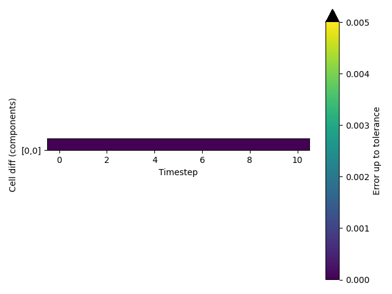

Cell vectors are passed correctly
---------------------------------

PLUMED must receive the cell vectors from the MD code in order to calculate CVs correctly.  
To test that cell vectors are passed correctly to PLUMED we run a short trajectory and output the cell vectors 
that are passed to PLUMED using the following command: 



 Click on the labels of the actions for more information on what each action computes 

<pre class="plumedlisting">
<b name="working1.datc" onclick='showPath("working1.dat","working1.datc","working1.datc","black")'>c</b>The CELL action with label <b>c</b> calculates the following quantities:<table  align="center" frame="void" width="95%" cellpadding="5%"><tr><td width="5%"><b> Quantity </b>  </td><td width="5%"><b> Type </b>  </td><td><b> Description </b> </td></tr><tr><td width="5%">c.ax</td><td width="5%">scalar</td><td>the ax component of the cell matrix</td></tr><tr><td width="5%">c.ay</td><td width="5%">scalar</td><td>the ay component of the cell matrix</td></tr><tr><td width="5%">c.az</td><td width="5%">scalar</td><td>the az component of the cell matrix</td></tr><tr><td width="5%">c.bx</td><td width="5%">scalar</td><td>the bx component of the cell matrix</td></tr><tr><td width="5%">c.by</td><td width="5%">scalar</td><td>the by component of the cell matrix</td></tr><tr><td width="5%">c.bz</td><td width="5%">scalar</td><td>the bz component of the cell matrix</td></tr><tr><td width="5%">c.cx</td><td width="5%">scalar</td><td>the cx component of the cell matrix</td></tr><tr><td width="5%">c.cy</td><td width="5%">scalar</td><td>the cy component of the cell matrix</td></tr><tr><td width="5%">c.cz</td><td width="5%">scalar</td><td>the cz component of the cell matrix</td></tr></table>: CELLGet the components of the simulation cell <a href="https://www.plumed.org/doc-master/user-doc/html/CELL" style="color:green">More details</a><i></i> 
</pre>

  

# Trajectory

Input and output files for the test calculation are available inthis [zip archive](basic_master.zip)

# Results

| MD code output | PLUMED output | Tolerance | % Difference | 
|:-------------|:--------------|:--------------|:--------------| 
| $\begin{array}{ccc} 2.7371 & 0.0000 & 0.0000 \\\\ 0.0000 & 2.7371 & 0.0000 \\\\ 0.0000 & 0.0000 & 2.7371 \end{array}$ | $\begin{array}{ccc} 2.7371 & 0.0000 & 0.0000 \\\\ 0.0000 & 2.7371 & 0.0000 \\\\ 0.0000 & 0.0000 & 2.7371 \end{array}$ | $\begin{array}{ccc} 0.0050 & 0.0050 & 0.0050 \\\\ 0.0050 & 0.0050 & 0.0050 \\\\ 0.0050 & 0.0050 & 0.0050 \end{array}$ | $\begin{array}{ccc} 0.0080 & 0.0000 & 0.0000 \\\\ 0.0000 & 0.0060 & 0.0000 \\\\ 0.0000 & 0.0000 & 0.0060 \end{array}$ | 
| $\begin{array}{ccc} 2.7371 & 0.0000 & 0.0000 \\\\ 0.0000 & 2.7371 & 0.0000 \\\\ 0.0000 & 0.0000 & 2.7371 \end{array}$ | $\begin{array}{ccc} 2.7371 & 0.0000 & 0.0000 \\\\ 0.0000 & 2.7371 & 0.0000 \\\\ 0.0000 & 0.0000 & 2.7371 \end{array}$ | $\begin{array}{ccc} 0.0050 & 0.0050 & 0.0050 \\\\ 0.0050 & 0.0050 & 0.0050 \\\\ 0.0050 & 0.0050 & 0.0050 \end{array}$ | $\begin{array}{ccc} 0.0053 & 0.0000 & 0.0000 \\\\ 0.0000 & 0.0033 & 0.0000 \\\\ 0.0000 & 0.0000 & 0.0033 \end{array}$ | 
| $\begin{array}{ccc} 2.7371 & 0.0000 & 0.0000 \\\\ 0.0000 & 2.7371 & 0.0000 \\\\ 0.0000 & 0.0000 & 2.7371 \end{array}$ | $\begin{array}{ccc} 2.7371 & 0.0000 & 0.0000 \\\\ 0.0000 & 2.7371 & 0.0000 \\\\ 0.0000 & 0.0000 & 2.7371 \end{array}$ | $\begin{array}{ccc} 0.0050 & 0.0050 & 0.0050 \\\\ 0.0050 & 0.0050 & 0.0050 \\\\ 0.0050 & 0.0050 & 0.0050 \end{array}$ | $\begin{array}{ccc} 0.0019 & 0.0000 & 0.0000 \\\\ 0.0000 & 0.0039 & 0.0000 \\\\ 0.0000 & 0.0000 & 0.0039 \end{array}$ | 
| $\begin{array}{ccc} 2.7372 & 0.0000 & 0.0000 \\\\ 0.0000 & 2.7372 & 0.0000 \\\\ 0.0000 & 0.0000 & 2.7372 \end{array}$ | $\begin{array}{ccc} 2.7372 & 0.0000 & 0.0000 \\\\ 0.0000 & 2.7372 & 0.0000 \\\\ 0.0000 & 0.0000 & 2.7372 \end{array}$ | $\begin{array}{ccc} 0.0050 & 0.0050 & 0.0050 \\\\ 0.0050 & 0.0050 & 0.0050 \\\\ 0.0050 & 0.0050 & 0.0050 \end{array}$ | $\begin{array}{ccc} 0.0090 & 0.0000 & 0.0000 \\\\ 0.0000 & 0.0090 & 0.0000 \\\\ 0.0000 & 0.0000 & 0.0090 \end{array}$ | 
| $\begin{array}{ccc} 2.7372 & 0.0000 & 0.0000 \\\\ 0.0000 & 2.7372 & 0.0000 \\\\ 0.0000 & 0.0000 & 2.7372 \end{array}$ | $\begin{array}{ccc} 2.7372 & 0.0000 & 0.0000 \\\\ 0.0000 & 2.7372 & 0.0000 \\\\ 0.0000 & 0.0000 & 2.7372 \end{array}$ | $\begin{array}{ccc} 0.0050 & 0.0050 & 0.0050 \\\\ 0.0050 & 0.0050 & 0.0050 \\\\ 0.0050 & 0.0050 & 0.0050 \end{array}$ | $\begin{array}{ccc} 0.0082 & 0.0000 & 0.0000 \\\\ 0.0000 & 0.0098 & 0.0000 \\\\ 0.0000 & 0.0000 & 0.0098 \end{array}$ | 
| $\begin{array}{ccc} 2.7372 & 0.0000 & 0.0000 \\\\ 0.0000 & 2.7372 & 0.0000 \\\\ 0.0000 & 0.0000 & 2.7372 \end{array}$ | $\begin{array}{ccc} 2.7372 & 0.0000 & 0.0000 \\\\ 0.0000 & 2.7372 & 0.0000 \\\\ 0.0000 & 0.0000 & 2.7372 \end{array}$ | $\begin{array}{ccc} 0.0050 & 0.0050 & 0.0050 \\\\ 0.0050 & 0.0050 & 0.0050 \\\\ 0.0050 & 0.0050 & 0.0050 \end{array}$ | $\begin{array}{ccc} 0.0085 & 0.0000 & 0.0000 \\\\ 0.0000 & 0.0095 & 0.0000 \\\\ 0.0000 & 0.0000 & 0.0095 \end{array}$ | 
| $\begin{array}{ccc} 2.7372 & 0.0000 & 0.0000 \\\\ 0.0000 & 2.7372 & 0.0000 \\\\ 0.0000 & 0.0000 & 2.7372 \end{array}$ | $\begin{array}{ccc} 2.7372 & 0.0000 & 0.0000 \\\\ 0.0000 & 2.7372 & 0.0000 \\\\ 0.0000 & 0.0000 & 2.7372 \end{array}$ | $\begin{array}{ccc} 0.0050 & 0.0050 & 0.0050 \\\\ 0.0050 & 0.0050 & 0.0050 \\\\ 0.0050 & 0.0050 & 0.0050 \end{array}$ | $\begin{array}{ccc} 0.0040 & 0.0000 & 0.0000 \\\\ 0.0000 & 0.0020 & 0.0000 \\\\ 0.0000 & 0.0000 & 0.0020 \end{array}$ | 
| $\begin{array}{ccc} 2.7373 & 0.0000 & 0.0000 \\\\ 0.0000 & 2.7373 & 0.0000 \\\\ 0.0000 & 0.0000 & 2.7373 \end{array}$ | $\begin{array}{ccc} 2.7373 & 0.0000 & 0.0000 \\\\ 0.0000 & 2.7373 & 0.0000 \\\\ 0.0000 & 0.0000 & 2.7373 \end{array}$ | $\begin{array}{ccc} 0.0050 & 0.0050 & 0.0050 \\\\ 0.0050 & 0.0050 & 0.0050 \\\\ 0.0050 & 0.0050 & 0.0050 \end{array}$ | $\begin{array}{ccc} 0.0057 & 0.0000 & 0.0000 \\\\ 0.0000 & 0.0037 & 0.0000 \\\\ 0.0000 & 0.0000 & 0.0037 \end{array}$ | 
| $\begin{array}{ccc} 2.7373 & 0.0000 & 0.0000 \\\\ 0.0000 & 2.7373 & 0.0000 \\\\ 0.0000 & 0.0000 & 2.7373 \end{array}$ | $\begin{array}{ccc} 2.7373 & 0.0000 & 0.0000 \\\\ 0.0000 & 2.7373 & 0.0000 \\\\ 0.0000 & 0.0000 & 2.7373 \end{array}$ | $\begin{array}{ccc} 0.0050 & 0.0050 & 0.0050 \\\\ 0.0050 & 0.0050 & 0.0050 \\\\ 0.0050 & 0.0050 & 0.0050 \end{array}$ | $\begin{array}{ccc} 0.0050 & 0.0000 & 0.0000 \\\\ 0.0000 & 0.0070 & 0.0000 \\\\ 0.0000 & 0.0000 & 0.0070 \end{array}$ | 
| $\begin{array}{ccc} 2.7374 & 0.0000 & 0.0000 \\\\ 0.0000 & 2.7374 & 0.0000 \\\\ 0.0000 & 0.0000 & 2.7374 \end{array}$ | $\begin{array}{ccc} 2.7374 & 0.0000 & 0.0000 \\\\ 0.0000 & 2.7374 & 0.0000 \\\\ 0.0000 & 0.0000 & 2.7374 \end{array}$ | $\begin{array}{ccc} 0.0050 & 0.0050 & 0.0050 \\\\ 0.0050 & 0.0050 & 0.0050 \\\\ 0.0050 & 0.0050 & 0.0050 \end{array}$ | $\begin{array}{ccc} 0.0082 & 0.0000 & 0.0000 \\\\ 0.0000 & 0.0098 & 0.0000 \\\\ 0.0000 & 0.0000 & 0.0098 \end{array}$ | 
| $\begin{array}{ccc} 2.7374 & 0.0000 & 0.0000 \\\\ 0.0000 & 2.7374 & 0.0000 \\\\ 0.0000 & 0.0000 & 2.7374 \end{array}$ | $\begin{array}{ccc} 2.7374 & 0.0000 & 0.0000 \\\\ 0.0000 & 2.7374 & 0.0000 \\\\ 0.0000 & 0.0000 & 2.7374 \end{array}$ | $\begin{array}{ccc} 0.0050 & 0.0050 & 0.0050 \\\\ 0.0050 & 0.0050 & 0.0050 \\\\ 0.0050 & 0.0050 & 0.0050 \end{array}$ | $\begin{array}{ccc} 0.0029 & 0.0000 & 0.0000 \\\\ 0.0000 & 0.0049 & 0.0000 \\\\ 0.0000 & 0.0000 & 0.0049 \end{array}$ | 

The table below includes some of the results from the calculation.  The columns contain:

1. The values for the cell vectors that were obtained from the MD code, $x_{md}$.
2. The values for the cell vectors that were obtained from PLUMED, $x_{pl}$.
3. The tolerances that were used when comparing these quantities, $\delta$. 
4. The values of $100\frac{\vert x_{md} - x_{pl}\vert }{ \delta }$.

If the PLUMED interface is working correctly the first two sets of numbers should be identical and the final column should be filled with zeros.

### Graphical representation (_beta_)
A visualization of the table above:  

