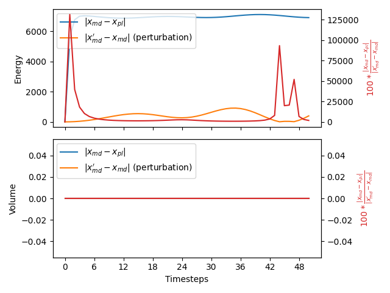

Check force on energy
---------------------

It is common practise to use the potential energy as a collective energy. Some MD codes thus pass the potential energy to PLUMED and
PLUMED can then apply forces on this collective variable.  We test that any forces that PLUMED applies on the potential energy are 
correctly passed back to the MD code by doing the following test.  We first run a short simulation at $T$ K with a timestep of $\tau$ ps.
During the course of this simulation we monitor the potential energy using the following PLUMED input:



 Click on the labels of the actions for more information on what each action computes 

<pre class="plumedlisting">
<b name="working1.date" onclick='showPath("working1.dat","working1.date","working1.date","black")'>e</b>The ENERGY action with label <b>e</b> calculates the following quantities:<table  align="center" frame="void" width="95%" cellpadding="5%"><tr><td width="5%"><b> Quantity </b>  </td><td width="5%"><b> Type </b>  </td><td><b> Description </b> </td></tr><tr><td width="5%">e</td><td width="5%">scalar</td><td>the internal energy</td></tr></table>: ENERGYCalculate the total potential energy of the simulation box. <a href="https://www.plumed.org/doc-master/user-doc/html/ENERGY" style="color:green">More details</a><i></i>
<b name="working1.datv" onclick='showPath("working1.dat","working1.datv","working1.datv","black")'>v</b>The VOLUME action with label <b>v</b> calculates the following quantities:<table  align="center" frame="void" width="95%" cellpadding="5%"><tr><td width="5%"><b> Quantity </b>  </td><td width="5%"><b> Type </b>  </td><td><b> Description </b> </td></tr><tr><td width="5%">v</td><td width="5%">scalar</td><td>the volume of simulation box</td></tr></table>: VOLUMECalculate the volume the simulation box. <a href="https://www.plumed.org/doc-master/user-doc/html/VOLUME" style="color:green">More details</a><i></i>
PRINTPrint quantities to a file. <a href="https://www.plumed.org/doc-master/user-doc/html/PRINT" style="color:green">More details</a><i></i> ARGthe labels of the values that you would like to print to the file<i></i>=<b name="working1.date">e</b>,<b name="working1.datv">v</b> FILEthe name of the file on which to output these quantities<i></i>=energy1
</pre>

  

We then run a second simulation (starting from identical conditions) at a temperature of $T\alpha$ and with a timestep of $\tau/\sqrt(\alpha)$.
The thermostat and barostat relaxation times are similarly divided by $\sqrt(\alpha)$.  In the tests that are run on this website we set $\sqrt(\alpha)=1.1$.
The PLUMED file above is used when this test is run but a different time series of energy values is recorded as the MD parameters in this second simulation are 
different.

If PLUMED is working correctly we should be able to recapture the time series of energy values for the first simulation by running an MD simulation with the modified 
parameters that were used in the second simulation and the following PLUMED input file:



 Click on the labels of the actions for more information on what each action computes 

<pre class="plumedlisting">
<b name="working2.date" onclick='showPath("working2.dat","working2.date","working2.date","black")'>e</b>The ENERGY action with label <b>e</b> calculates the following quantities:<table  align="center" frame="void" width="95%" cellpadding="5%"><tr><td width="5%"><b> Quantity </b>  </td><td width="5%"><b> Type </b>  </td><td><b> Description </b> </td></tr><tr><td width="5%">e</td><td width="5%">scalar</td><td>the internal energy</td></tr></table>: ENERGYCalculate the total potential energy of the simulation box. <a href="https://www.plumed.org/doc-master/user-doc/html/ENERGY" style="color:green">More details</a><i></i>
<b name="working2.datv" onclick='showPath("working2.dat","working2.datv","working2.datv","black")'>v</b>The VOLUME action with label <b>v</b> calculates the following quantities:<table  align="center" frame="void" width="95%" cellpadding="5%"><tr><td width="5%"><b> Quantity </b>  </td><td width="5%"><b> Type </b>  </td><td><b> Description </b> </td></tr><tr><td width="5%">v</td><td width="5%">scalar</td><td>the volume of simulation box</td></tr></table>: VOLUMECalculate the volume the simulation box. <a href="https://www.plumed.org/doc-master/user-doc/html/VOLUME" style="color:green">More details</a><i></i>
# slope is such that 
PRINTPrint quantities to a file. <a href="https://www.plumed.org/doc-master/user-doc/html/PRINT" style="color:green">More details</a><i></i> ARGthe labels of the values that you would like to print to the file<i></i>=<b name="working2.date">e</b> FILEthe name of the file on which to output these quantities<i></i>=energy2
# slope should be (alpha-1)=0.21
The PRINT action with label <b></b> calculates somethingRESTRAINTAdds harmonic and/or linear restraints on one or more variables. <a href="https://www.plumed.org/doc-master/user-doc/html/RESTRAINT" style="color:green">More details</a><i></i> ATthe position of the restraint<i></i>=0.0 ARGthe values the harmonic restraint acts upon<i></i>=<b name="working2.date">e</b> SLOPE specifies that the restraint is linear and what the values of the force constants on each of the variables are<i></i>=0.21
</pre>

  

In other words, when forces are passed correctly the time series for the energies and volumes from the first and third of these calculations should be identical.  

To determine if PLUMED passes this test we calculate the difference between the time series that were observed in the first and third simulations described above.
We then divide this by the difference between the first and second time series.

An NPT version of this calculation is performed as well as an NVT calculation if the virial is passed to PLUMED.

# Trajectories

 1. Input and output files for the unpeturbed calculation are available in this [zip archive](engforces1_master.zip)

 2. Input and output files for the peturbed calculation are available in this [zip archive](engforces3_master.zip)

 3. Input and output files for the peturbed calculation in which a PLUMED restraint is used to undo the effect of the changed MD parameters are available in this [zip archive](engforces2_master.zip)

# Results

| Original | With PLUMED | Effect of peturbation | % Difference | 
|:-------------|:--------------|:--------------|:--------------| 
| -26662.0232 20.5064 | -26662.0232 20.5064 | 0.0000 0.0000 | 0.0000 0.0000 | 
| -26632.7822 20.5064 | -32231.8071 20.5064 | 4.2677 0.0000 | 131194.3571 0.0000 | 
| -26571.5447 20.5064 | -33340.2242 20.5064 | 17.0923 0.0000 | 39600.7042 0.0000 | 
| -26484.0630 20.5064 | -33485.5101 20.5064 | 38.6812 0.0000 | 18100.3781 0.0000 | 
| -26377.7580 20.5064 | -33409.7151 20.5064 | 68.9222 0.0000 | 10202.7422 0.0000 | 
| -26261.9983 20.5064 | -33278.0385 20.5064 | 107.5879 0.0000 | 6521.2141 0.0000 | 
| -26146.3685 20.5064 | -33134.7565 20.5064 | 153.7672 0.0000 | 4544.7832 0.0000 | 
| -26040.4814 20.5064 | -32998.7803 20.5064 | 206.2636 0.0000 | 3373.4989 0.0000 | 
| -25952.9779 20.5064 | -32882.7218 20.5064 | 263.4308 0.0000 | 2630.5744 0.0000 | 
| -25890.2906 20.5064 | -32795.6622 20.5064 | 322.5708 0.0000 | 2140.7303 0.0000 | 
| -25856.3620 20.5064 | -32743.4511 20.5064 | 380.6413 0.0000 | 1809.3384 0.0000 | 
| -25852.3703 20.5064 | -32728.4951 20.5064 | 434.4447 0.0000 | 1582.7388 0.0000 | 
| -25876.6243 20.5064 | -32749.6082 20.5064 | 480.8288 0.0000 | 1429.4036 0.0000 | 
| -25924.3898 20.5064 | -32801.8075 20.5064 | 516.2123 0.0000 | 1332.2846 0.0000 | 
| -25989.2245 20.5064 | -32877.6041 20.5064 | 538.4169 0.0000 | 1279.3764 0.0000 | 
| -26062.6224 20.5064 | -32966.9192 20.5064 | 545.3386 0.0000 | 1266.0569 0.0000 | 
| -26136.2184 20.5064 | -33059.2715 20.5064 | 536.6940 0.0000 | 1289.9442 0.0000 | 
| -26201.9884 20.5064 | -33144.4354 20.5064 | 513.8325 0.0000 | 1351.1108 0.0000 | 
| -26252.5290 20.5064 | -33212.8605 20.5064 | 478.2871 0.0000 | 1455.2621 0.0000 | 
| -26283.0556 20.5064 | -33257.7563 20.5064 | 434.0687 0.0000 | 1606.8196 0.0000 | 

The table below includes some of the results from the calculation.  The columns contain:

1. Time series for the energy and volume that were obtained from the simulation at $T$ K, $x_{md}$.
2. Time series for the energy and volume that were obtained from the simulation at $\alpha T$ K and in which PLUMED applied a restraint on the energy, $x_{pl}$.
3. The absolute value of the difference between the time series of energies and volumes that were obtained from the simulations running at $T$ K and $\alpha T$ K, $\vert x_{md}'-x_{md} \vert$.  No PLUMED restraints were applied in either of these simulations.
4. The values of $100\frac{\vert x_{md} - x_{pl}\vert }{ \vert x_{md}'-x_{md} \vert}$. 

If the PLUMED interface is working correctly the first two sets of numbers should be identical and the final column should be filled with zeros.

### Graphical representation (_beta_)
A visualization of the table above:  

