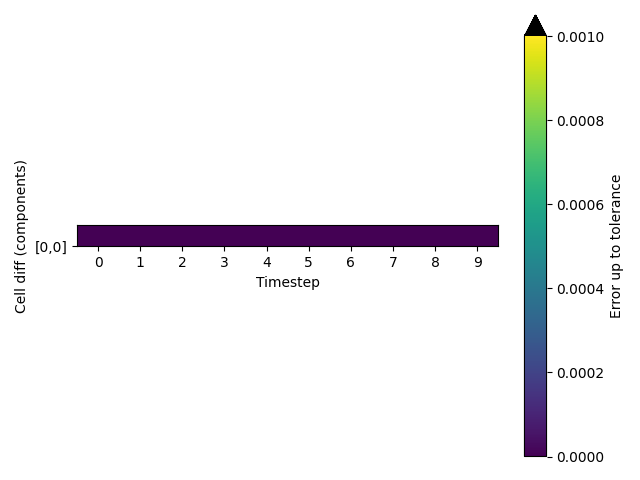

Cell vectors are passed correctly
---------------------------------

PLUMED must receive the cell vectors from the MD code in order to calculate CVs correctly.  
To test that cell vectors are passed correctly to PLUMED we run a short trajectory and output the cell vectors 
that are passed to PLUMED using the following command: 



 Click on the labels of the actions for more information on what each action computes 

<pre class="plumedlisting">
<b name="working1.datc" onclick='showPath("working1.dat","working1.datc","working1.datc","black")'>c</b>The CELL action with label <b>c</b> calculates the following quantities:<table  align="center" frame="void" width="95%" cellpadding="5%"><tr><td width="5%"><b> Quantity </b>  </td><td width="5%"><b> Type </b>  </td><td><b> Description </b> </td></tr><tr><td width="5%">c.ax</td><td width="5%">scalar</td><td>the ax component of the cell matrix</td></tr><tr><td width="5%">c.ay</td><td width="5%">scalar</td><td>the ay component of the cell matrix</td></tr><tr><td width="5%">c.az</td><td width="5%">scalar</td><td>the az component of the cell matrix</td></tr><tr><td width="5%">c.bx</td><td width="5%">scalar</td><td>the bx component of the cell matrix</td></tr><tr><td width="5%">c.by</td><td width="5%">scalar</td><td>the by component of the cell matrix</td></tr><tr><td width="5%">c.bz</td><td width="5%">scalar</td><td>the bz component of the cell matrix</td></tr><tr><td width="5%">c.cx</td><td width="5%">scalar</td><td>the cx component of the cell matrix</td></tr><tr><td width="5%">c.cy</td><td width="5%">scalar</td><td>the cy component of the cell matrix</td></tr><tr><td width="5%">c.cz</td><td width="5%">scalar</td><td>the cz component of the cell matrix</td></tr></table>: CELLGet the components of the simulation cell <a href="https://www.plumed.org/doc-master/user-doc/html/CELL" style="color:green">More details</a><i></i> 
</pre>

  

# Trajectory

Input and output files for the test calculation are available inthis [zip archive](basic_v2.10.zip)

# Results

| MD code output | PLUMED output | Tolerance | % Difference | 
|:-------------|:--------------|:--------------|:--------------| 
| $\begin{array}{ccc} -0.2694 & 0.0000 & 0.2694 \\\\ 0.0000 & 0.2694 & 0.2694 \\\\ -0.2694 & 0.2694 & 0.0000 \end{array}$ | $\begin{array}{ccc} -0.2694 & 0.0000 & 0.2694 \\\\ 0.0000 & 0.2694 & 0.2694 \\\\ -0.2694 & 0.2694 & 0.0000 \end{array}$ | $\begin{array}{ccc} 0.0010 & 0.0010 & 0.0010 \\\\ 0.0010 & 0.0010 & 0.0010 \\\\ 0.0010 & 0.0010 & 0.0010 \end{array}$ | $\begin{array}{ccc} 0.0220 & 0.0000 & 0.0220 \\\\ 0.0000 & 0.0220 & 0.0220 \\\\ 0.0220 & 0.0220 & 0.0000 \end{array}$ | 
| $\begin{array}{ccc} -0.2694 & -0.0000 & 0.2694 \\\\ 0.0000 & 0.2694 & 0.2694 \\\\ -0.2694 & 0.2694 & -0.0000 \end{array}$ | $\begin{array}{ccc} -0.2694 & -0.0000 & 0.2694 \\\\ 0.0000 & 0.2694 & 0.2694 \\\\ -0.2694 & 0.2694 & -0.0000 \end{array}$ | $\begin{array}{ccc} 0.0010 & 0.0010 & 0.0010 \\\\ 0.0010 & 0.0010 & 0.0010 \\\\ 0.0010 & 0.0010 & 0.0010 \end{array}$ | $\begin{array}{ccc} 0.0323 & 0.0000 & 0.0323 \\\\ 0.0426 & 0.0103 & 0.0103 \\\\ 0.0323 & 0.0323 & 0.0000 \end{array}$ | 
| $\begin{array}{ccc} -0.2694 & 0.0000 & 0.2694 \\\\ 0.0000 & 0.2694 & 0.2694 \\\\ -0.2694 & 0.2694 & -0.0000 \end{array}$ | $\begin{array}{ccc} -0.2694 & 0.0000 & 0.2694 \\\\ 0.0000 & 0.2694 & 0.2694 \\\\ -0.2694 & 0.2694 & -0.0000 \end{array}$ | $\begin{array}{ccc} 0.0010 & 0.0010 & 0.0010 \\\\ 0.0010 & 0.0010 & 0.0010 \\\\ 0.0010 & 0.0010 & 0.0010 \end{array}$ | $\begin{array}{ccc} 0.0185 & 0.0000 & 0.0185 \\\\ 0.0480 & 0.0293 & 0.0295 \\\\ 0.0180 & 0.0181 & 0.0005 \end{array}$ | 
| $\begin{array}{ccc} -0.2694 & 0.0000 & 0.2694 \\\\ 0.0000 & 0.2694 & 0.2694 \\\\ -0.2694 & 0.2694 & -0.0000 \end{array}$ | $\begin{array}{ccc} -0.2694 & 0.0000 & 0.2694 \\\\ 0.0000 & 0.2694 & 0.2694 \\\\ -0.2694 & 0.2694 & -0.0000 \end{array}$ | $\begin{array}{ccc} 0.0010 & 0.0010 & 0.0010 \\\\ 0.0010 & 0.0010 & 0.0010 \\\\ 0.0010 & 0.0010 & 0.0010 \end{array}$ | $\begin{array}{ccc} 0.0378 & 0.0001 & 0.0377 \\\\ 0.0140 & 0.0242 & 0.0237 \\\\ 0.0357 & 0.0361 & 0.0020 \end{array}$ | 
| $\begin{array}{ccc} -0.2695 & 0.0000 & 0.2695 \\\\ 0.0000 & 0.2695 & 0.2695 \\\\ -0.2695 & 0.2695 & -0.0000 \end{array}$ | $\begin{array}{ccc} -0.2695 & 0.0000 & 0.2695 \\\\ 0.0000 & 0.2695 & 0.2695 \\\\ -0.2695 & 0.2695 & -0.0000 \end{array}$ | $\begin{array}{ccc} 0.0010 & 0.0010 & 0.0010 \\\\ 0.0010 & 0.0010 & 0.0010 \\\\ 0.0010 & 0.0010 & 0.0010 \end{array}$ | $\begin{array}{ccc} 0.0082 & 0.0002 & 0.0083 \\\\ 0.0374 & 0.0447 & 0.0458 \\\\ 0.0133 & 0.0122 & 0.0049 \end{array}$ | 
| $\begin{array}{ccc} -0.2695 & 0.0000 & 0.2695 \\\\ 0.0000 & 0.2695 & 0.2695 \\\\ -0.2695 & 0.2695 & -0.0000 \end{array}$ | $\begin{array}{ccc} -0.2695 & 0.0000 & 0.2695 \\\\ 0.0000 & 0.2695 & 0.2695 \\\\ -0.2695 & 0.2695 & -0.0000 \end{array}$ | $\begin{array}{ccc} 0.0010 & 0.0010 & 0.0010 \\\\ 0.0010 & 0.0010 & 0.0010 \\\\ 0.0010 & 0.0010 & 0.0010 \end{array}$ | $\begin{array}{ccc} 0.0170 & 0.0003 & 0.0171 \\\\ 0.0139 & 0.0292 & 0.0313 \\\\ 0.0270 & 0.0249 & 0.0097 \end{array}$ | 
| $\begin{array}{ccc} -0.2696 & 0.0000 & 0.2696 \\\\ 0.0000 & 0.2696 & 0.2696 \\\\ -0.2696 & 0.2696 & -0.0000 \end{array}$ | $\begin{array}{ccc} -0.2696 & 0.0000 & 0.2696 \\\\ 0.0000 & 0.2696 & 0.2696 \\\\ -0.2696 & 0.2696 & -0.0000 \end{array}$ | $\begin{array}{ccc} 0.0010 & 0.0010 & 0.0010 \\\\ 0.0010 & 0.0010 & 0.0010 \\\\ 0.0010 & 0.0010 & 0.0010 \end{array}$ | $\begin{array}{ccc} 0.0147 & 0.0006 & 0.0145 \\\\ 0.0385 & 0.0210 & 0.0246 \\\\ 0.0025 & 0.0009 & 0.0166 \end{array}$ | 
| $\begin{array}{ccc} -0.2697 & 0.0000 & 0.2697 \\\\ 0.0000 & 0.2697 & 0.2697 \\\\ -0.2697 & 0.2697 & -0.0000 \end{array}$ | $\begin{array}{ccc} -0.2697 & 0.0000 & 0.2697 \\\\ 0.0000 & 0.2697 & 0.2697 \\\\ -0.2697 & 0.2697 & -0.0000 \end{array}$ | $\begin{array}{ccc} 0.0010 & 0.0010 & 0.0010 \\\\ 0.0010 & 0.0010 & 0.0010 \\\\ 0.0010 & 0.0010 & 0.0010 \end{array}$ | $\begin{array}{ccc} 0.0095 & 0.0009 & 0.0096 \\\\ 0.0052 & 0.0103 & 0.0157 \\\\ 0.0365 & 0.0313 & 0.0261 \end{array}$ | 
| $\begin{array}{ccc} -0.2698 & 0.0000 & 0.2698 \\\\ 0.0000 & 0.2698 & 0.2698 \\\\ -0.2698 & 0.2698 & -0.0000 \end{array}$ | $\begin{array}{ccc} -0.2698 & 0.0000 & 0.2698 \\\\ 0.0000 & 0.2698 & 0.2698 \\\\ -0.2698 & 0.2698 & -0.0000 \end{array}$ | $\begin{array}{ccc} 0.0010 & 0.0010 & 0.0010 \\\\ 0.0010 & 0.0010 & 0.0010 \\\\ 0.0010 & 0.0010 & 0.0010 \end{array}$ | $\begin{array}{ccc} 0.0153 & 0.0014 & 0.0150 \\\\ 0.0072 & 0.0140 & 0.0065 \\\\ 0.0245 & 0.0172 & 0.0385 \end{array}$ | 
| $\begin{array}{ccc} -0.2699 & 0.0000 & 0.2699 \\\\ 0.0000 & 0.2699 & 0.2699 \\\\ -0.2699 & 0.2699 & -0.0000 \end{array}$ | $\begin{array}{ccc} -0.2699 & 0.0000 & 0.2699 \\\\ 0.0000 & 0.2699 & 0.2699 \\\\ -0.2699 & 0.2699 & -0.0000 \end{array}$ | $\begin{array}{ccc} 0.0010 & 0.0010 & 0.0010 \\\\ 0.0010 & 0.0010 & 0.0010 \\\\ 0.0010 & 0.0010 & 0.0010 \end{array}$ | $\begin{array}{ccc} 0.0056 & 0.0019 & 0.0060 \\\\ 0.0375 & 0.0354 & 0.0454 \\\\ 0.0386 & 0.0483 & 0.0461 \end{array}$ | 

The table below includes some of the results from the calculation.  The columns contain:

1. The values for the cell vectors that were obtained from the MD code, $x_{md}$.
2. The values for the cell vectors that were obtained from PLUMED, $x_{pl}$.
3. The tolerances that were used when comparing these quantities, $\delta$. 
4. The values of $100\frac{\vert x_{md} - x_{pl}\vert }{ \delta }$.

If the PLUMED interface is working correctly the first two sets of numbers should be identical and the final column should be filled with zeros.

### Graphical representation (_beta_)
A visualization of the table above:  

