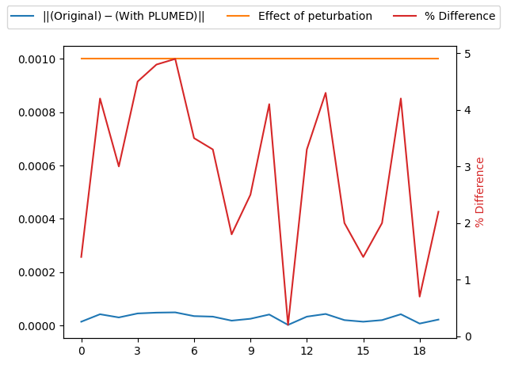

Checking PLUMED can add a restraint
-----------------------------------

To check that the forces are being correctly passed from PLUMED to the MD code we test that the result from a PLUMED
calculation where the following plumed input is used produces results that are equivalent to the result that is obtained
when the restraint is applied within the MD code.



 Click on the labels of the actions for more information on what each action computes 

<pre class="plumedlisting">
<b name="working1.datdd" onclick='showPath("working1.dat","working1.datdd","working1.datdd","black")'>dd</b>The DISTANCE action with label <b>dd</b> calculates the following quantities:<table  align="center" frame="void" width="95%" cellpadding="5%"><tr><td width="5%"><b> Quantity </b>  </td><td width="5%"><b> Type </b>  </td><td><b> Description </b> </td></tr><tr><td width="5%">dd</td><td width="5%">scalar</td><td>the DISTANCE between this pair of atoms</td></tr></table>: DISTANCECalculate the distance/s between pairs of atoms. <a href="https://www.plumed.org/doc-master/user-doc/html/DISTANCE" style="color:green">More details</a><i></i> ATOMSthe pair of atom that we are calculating the distance between<i></i>=1,2 
RESTRAINTAdds harmonic and/or linear restraints on one or more variables. <a href="https://www.plumed.org/doc-master/user-doc/html/RESTRAINT" style="color:green">More details</a><i></i> ARGthe values the harmonic restraint acts upon<i></i>=<b name="working1.datdd">dd</b> KAPPA specifies that the restraint is harmonic and what the values of the force constants on each of the variables are<i></i>=2000 ATthe position of the restraint<i></i>=0.6
The RESTRAINT action with label <b></b> calculates the following quantities:<table  align="center" frame="void" width="95%" cellpadding="5%"><tr><td width="5%"><b> Quantity </b>  </td><td><b> Description </b> </td></tr><tr><td width="5%">.bias</td><td>the instantaneous value of the bias potential</td></tr><tr><td width="5%">.force2</td><td>the instantaneous value of the squared force due to this bias potential</td></tr></table>PRINTPrint quantities to a file. <a href="https://www.plumed.org/doc-master/user-doc/html/PRINT" style="color:green">More details</a><i></i> ARGthe labels of the values that you would like to print to the file<i></i>=<b name="working1.datdd">dd</b> FILEthe name of the file on which to output these quantities<i></i>=plumed_restraint
</pre>

  

To check that the two ways of applying the restraint are equivalent we use the following PLUMED input for the calculation
where the MD code applies the restraint:



 Click on the labels of the actions for more information on what each action computes 

<pre class="plumedlisting">
<b name="working2.datdd" onclick='showPath("working2.dat","working2.datdd","working2.datdd","black")'>dd</b>The DISTANCE action with label <b>dd</b> calculates the following quantities:<table  align="center" frame="void" width="95%" cellpadding="5%"><tr><td width="5%"><b> Quantity </b>  </td><td width="5%"><b> Type </b>  </td><td><b> Description </b> </td></tr><tr><td width="5%">dd</td><td width="5%">scalar</td><td>the DISTANCE between this pair of atoms</td></tr></table>: DISTANCECalculate the distance/s between pairs of atoms. <a href="https://www.plumed.org/doc-master/user-doc/html/DISTANCE" style="color:green">More details</a><i></i> ATOMSthe pair of atom that we are calculating the distance between<i></i>=1,2 
PRINTPrint quantities to a file. <a href="https://www.plumed.org/doc-master/user-doc/html/PRINT" style="color:green">More details</a><i></i> ARGthe labels of the values that you would like to print to the file<i></i>=<b name="working2.datdd">dd</b> FILEthe name of the file on which to output these quantities<i></i>=mdcode_restraint
</pre>

  

# Trajectories

 1. Input and output files for the calculation where the restraint is applied by the MD code available in this [zip archive](forces1_master.zip)

 2. Input and output files for the calculation where the restraint is applied by PLUMED are available in this [zip archive](forces2_master.zip

# Results

| Original | With PLUMED | Effect of peturbation | % Difference | 
|:-------------|:--------------|:--------------|:--------------| 
| 1.1976 | 1.197586 | 0.001 | 1.399999999995849 |
| 1.2069 | 1.206942 | 0.001 | 4.199999999987547 |
| 1.2143 | 1.21433 | 0.001 | 2.999999999997449 |
| 1.2203 | 1.220255 | 0.001 | 4.4999999999850715 |
| 1.2253 | 1.225348 | 0.001 | 4.8000000000048 |
| 1.2275 | 1.227451 | 0.001 | 4.899999999996574 |
| 1.2262 | 1.226235 | 0.001 | 3.5000000000007248 |
| 1.2215 | 1.221467 | 0.001 | 3.2999999999949736 |
| 1.214 | 1.213982 | 0.001 | 1.8000000000073513 |
| 1.2042 | 1.204175 | 0.001 | 2.4999999999941735 |
| 1.1942 | 1.194159 | 0.001 | 4.099999999995774 |
| 1.1836 | 1.183602 | 0.001 | 0.20000000000575113 |
| 1.1745 | 1.174533 | 0.001 | 3.2999999999949736 |
| 1.1677 | 1.167743 | 0.001 | 4.300000000001525 |
| 1.1649 | 1.16488 | 0.001 | 2.0000000000131024 |
| 1.1652 | 1.165186 | 0.001 | 1.399999999995849 |
| 1.1686 | 1.16862 | 0.001 | 1.999999999990898 |
| 1.1762 | 1.176242 | 0.001 | 4.2000000000097515 |
| 1.186 | 1.185993 | 0.001 | 0.6999999999868223 |
| 1.1976 | 1.197622 | 0.001 | 2.199999999996649 |

The table below includes some of the results from the calculation.  The columns contain:

1. The time series of distance values that were obtained when the restraint was applied by the MD code, $x_{md}$.
2. The time series of distance values that were obtained when the restraint was applied by PLUMED, $x_{pl}$.
3. The tolerances that were used when comparing these quantities, $\delta$.
4. The values of $100\frac{\vert x_{md} - x_{pl}\vert }{ \delta}$.

If the PLUMED interface is working correctly the first two sets of numbers should be identical and the final column should be filled with zeros.

### Graphical representation (_beta_)
A visualization of the table above:  

